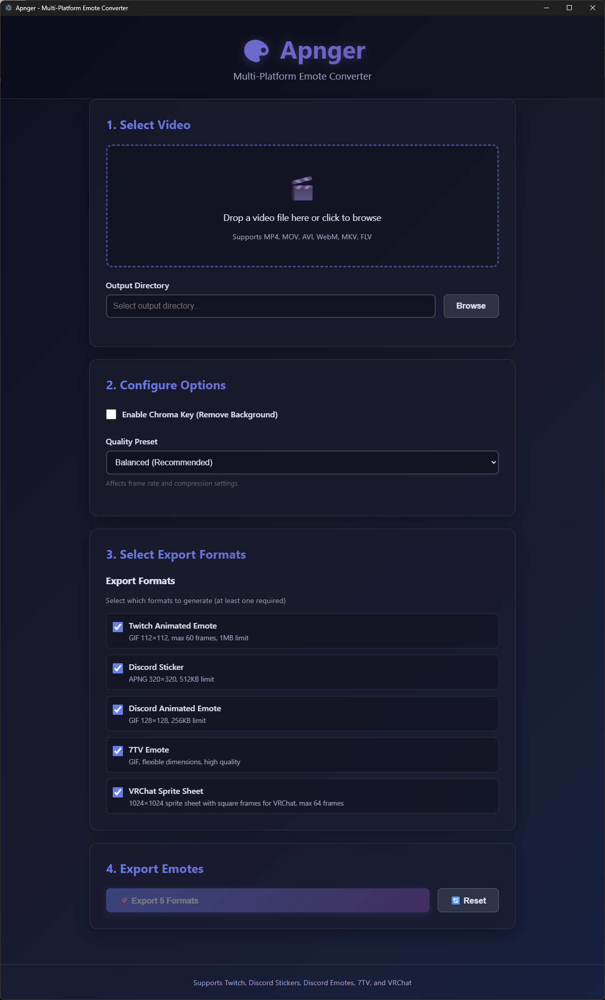
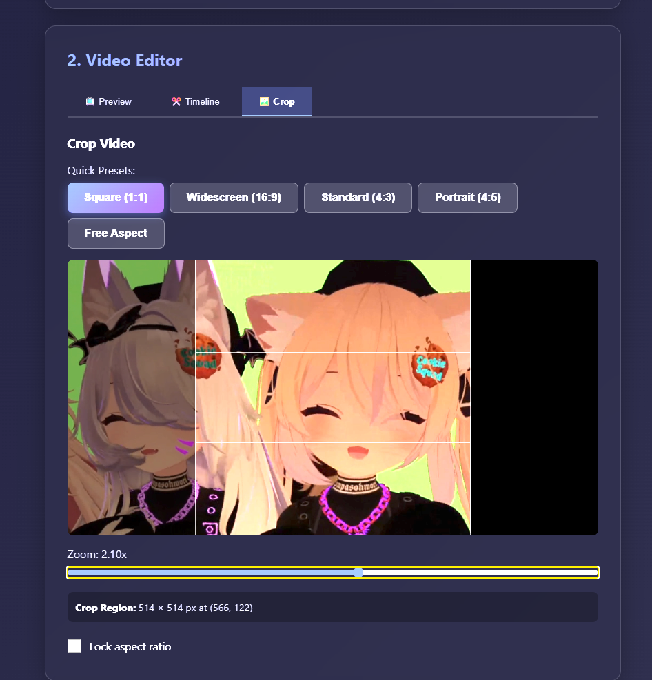
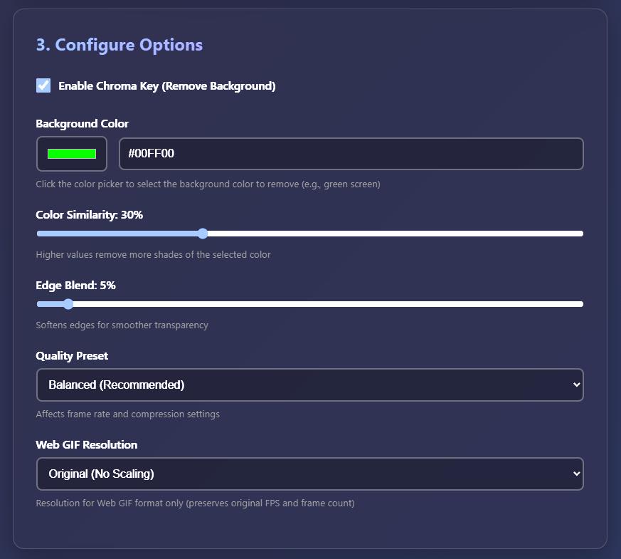

# 🎨 Apnger

**Professional Video-to-Emote Converter with Built-in Video Editor**

A cross-platform desktop application that converts videos into optimized emotes for Twitch, Discord, 7TV, and VRChat. Features a professional video editor with frame-accurate timeline, interactive cropping, chroma key removal, and one-click export to all formats.


## 🖼️ Screenshots

### Startup Interface


### Visual Timeline Editor


### Interactive Crop Editor


### Chroma Key & Export Options


## ✨ Key Features

### 🎬 Video Editor
- **Visual Timeline**: Frame-accurate scrubbing with draggable playhead
- **Frame-by-Frame Navigation**: Step through video one frame at a time
- **Trim & Slice**: Simple trim mode or multi-segment editing
- **Interactive Cropping**: Drag-and-resize crop regions with live preview
- **Crop Presets**: One-click Square (1:1), Widescreen (16:9), Portrait (4:5), and more
- **Real-Time Preview**: See the exact frame you're working with

### 🟢 Chroma Key Processing
- **Visual Color Picker**: Click to select background color to remove
- **Live Preview**: See results in real-time as you adjust settings
- **Advanced Controls**: Similarity and blend adjustments for perfect transparency
- **Despill Filter**: Automatically removes color fringing from edges
- **Multi-Color Support**: Green screen, blue screen, or any custom color

### 🚀 Export & Optimization
- **5 Export Formats**: Twitch, Discord Sticker, Discord Emote, 7TV, VRChat Sprite Sheet
- **Format Selection**: Choose which formats to export with checkboxes
- **Auto-Optimization**: Iterative compression to meet platform size limits
- **Smart Resizing**: Automatically fills target dimensions after cropping
- **Batch Export**: Generate all selected formats in one click
- **Progress Tracking**: Real-time progress bars for each format

### 💨 User Experience
- **Drag & Drop**: Drop video files anywhere in the app
- **Auto-Set Paths**: Output directory automatically set to video location
- **Zero Dependencies**: FFmpeg bundled - no separate installation needed
- **Portable**: Single executable, runs from anywhere
- **Cross-Platform**: Windows, macOS, and Linux support

## 📋 Supported Output Formats

| Platform | Format | Dimensions | Max Size | Max Frames | Notes |
|----------|--------|------------|----------|------------|-------|
| **Twitch** | GIF | 112×112px | 1MB | 60 | 30fps cap for smaller files |
| **Discord Sticker** | APNG | 320×320px | 512KB | Unlimited | Perfect square required |
| **Discord Emote** | GIF | 128×128px | 256KB | Unlimited | Aggressive compression |
| **7TV** | GIF | Flexible | 3MB | Unlimited | High quality, wide aspect ratios supported |
| **VRChat** | PNG Sprite Sheet | 1024×1024 | 10MB | 64 | Filename includes FPS and frame count |

## 🚀 Quick Start

### Installation

**Windows**: Download `Apnger-2.5.2.exe` from [Releases](https://github.com/kittynXR/apnger/releases) - no installation needed, just run!

**macOS**: Download `Apnger-2.5.2.dmg`, open and drag to Applications

**Linux**: Download `Apnger-2.5.2.AppImage`, make executable (`chmod +x`), and run

### Basic Workflow

1. **Load Video**: Drag-drop or browse to select your video file
2. **Edit Video** (Optional):
   - **Preview Tab**: View sample frames from start, middle, and end
   - **Timeline Tab**: Trim video or create multi-segment clips
     - Scrub through video frame-by-frame
     - Set exact start/end points
     - Visual playhead shows current position
   - **Crop Tab**: Adjust framing with interactive cropper
     - Quick presets: Square, 16:9, 4:3, etc.
     - Drag and zoom for precise control
3. **Configure Options**:
   - Enable chroma key for greenscreen removal
   - Select background color
   - Adjust quality preset
4. **Select Formats**: Check which formats you want to export
5. **Export**: Click "Export" and wait for processing to complete

## 💡 Video Editor Guide

### Timeline Editor Features

**Frame-Accurate Navigation**:
- **Click Timeline**: Jump to any position instantly
- **Drag Playhead**: Smooth scrubbing through entire video
- **Prev/Next Frame**: Step backward or forward by single frames
- **Start/End Buttons**: Jump to beginning or end
- **Frame Counter**: See exact frame number (e.g., "Frame 155 of 300")

**Simple Trim Mode**:
- Scrub to desired start point → Click "Set Start Here"
- Scrub to desired end point → Click "Set End Here"
- Visual overlay shows trim region on timeline
- Only selected portion will be exported

**Multi-Segment Mode**:
- Scrub to first segment start → Click "Mark Start"
- Scrub to first segment end → Click "Mark End"
- Click "+ Add Segment" to save
- Repeat for additional segments
- Enable/disable segments individually
- Segments will be merged in final export
- "Clear All Segments" button to start over

### Crop Editor Features

**Quick Presets**:
- **Square (1:1)**: Perfect for Discord stickers
- **Widescreen (16:9)**: Standard video aspect ratio
- **Standard (4:3)**: Classic aspect ratio
- **Portrait (4:5)**: Instagram-style vertical
- **Free Aspect**: Crop to any size/shape

**Interactive Controls**:
- **Drag**: Move crop region
- **Pinch/Zoom**: Resize crop area
- **Zoom Slider**: Fine control from 1x to 3x
- **Lock Aspect**: Maintain ratio while resizing
- **Live Dimensions**: See exact pixel size as you crop

**Auto-Resize**:
- After cropping, video automatically scales to fill export dimensions
- No black bars or letterboxing
- Content fills entire frame

## 🎨 Chroma Key Tips

**For Best Results**:
- Use even, well-lit greenscreen/bluescreen
- Avoid shadows on background
- Start with **Similarity: 30%** and **Blend: 10%**
- Increase similarity if background isn't fully removed
- Decrease similarity if subject edges are becoming transparent
- Increase blend for softer, more natural edges

**Common Background Colors**:
- Green screen: `#00FF00`
- Blue screen: `#0000FF`
- Pure black: `#000000`
- Pure white: `#FFFFFF`

**Advanced**:
- Despill filter automatically removes color fringing
- Gamma/saturation adjustments compensate for despill
- Live FFmpeg previews show exact output

## 🔧 Building from Source

### Prerequisites
- Node.js 18+
- npm 9+
- FFmpeg binaries (see below)

### Setup

```bash
# Clone repository
git clone https://github.com/kittynXR/apnger.git
cd apnger

# Install dependencies
npm install

# Download FFmpeg binaries
# Place ffmpeg.exe and ffprobe.exe in resources/bin/
# Windows: https://github.com/BtbN/FFmpeg-Builds/releases
# macOS/Linux: Install via package manager or download from ffmpeg.org

# Development mode with hot reload
npm run dev

# Build application
npm run build

# Create distributable
npm run dist        # Current platform
npm run dist:win    # Windows
npm run dist:mac    # macOS
npm run dist:linux  # Linux
```

## 📦 Tech Stack

- **Desktop Framework**: Electron 38+
- **Frontend**: React 19 + TypeScript 5
- **Build Tool**: Vite 7
- **Video Processing**: FFmpeg 8.0 (bundled)
- **State Management**: Zustand
- **Crop UI**: react-easy-crop
- **Bundler**: electron-builder

## 🛠️ Development

### Project Structure

```
apnger/
├── src/
│   ├── main/              # Electron main process
│   │   ├── main.ts        # App entry, IPC handlers, FFmpeg paths
│   │   └── preload.ts     # Secure IPC bridge
│   ├── renderer/          # React frontend
│   │   ├── App.tsx        # Main app component
│   │   ├── store.ts       # Zustand state management
│   │   └── components/    # UI components
│   │       ├── FileInput.tsx
│   │       ├── VideoEditor.tsx      # Tabbed editor interface
│   │       ├── TimelineEditor.tsx   # Visual timeline with scrubbing
│   │       ├── CropEditor.tsx       # Interactive crop tool
│   │       ├── ProcessingOptions.tsx
│   │       ├── FormatSelector.tsx
│   │       ├── EmotePreviews.tsx
│   │       └── ResultsDisplay.tsx
│   └── shared/            # Shared between main and renderer
│       ├── types.ts       # TypeScript interfaces
│       └── processor.ts   # FFmpeg video processing logic
├── resources/
│   └── bin/               # FFmpeg binaries (ffmpeg.exe, ffprobe.exe)
├── screenshots/           # App screenshots for README
└── dist/                  # Build output
```

### Key Commands

```bash
npm run dev              # Start development server
npm run build            # Build for production
npm run dist             # Package executable
npm run dev:vite         # Vite dev server only
npm run build:renderer   # Build React app
npm run build:main       # Compile main process TypeScript
```

## 🎯 Roadmap

- [x] Drag-and-drop video input
- [x] Chroma key background removal
- [x] FFmpeg-powered accurate previews
- [x] Multi-platform export (Twitch, Discord, 7TV, VRChat)
- [x] Built-in FFmpeg bundling
- [x] Visual timeline editor with frame-accurate scrubbing
- [x] Interactive crop tool with presets
- [x] Timeline trim and multi-segment editing
- [x] Format selection checkboxes
- [x] Auto-set output directory
- [ ] Full multi-segment merge implementation
- [ ] Keyboard shortcuts for timeline navigation
- [ ] Batch processing multiple videos
- [ ] Custom preset saving
- [ ] Video effects and filters
- [ ] Audio extraction options

## 🤝 Contributing

Contributions are welcome! Please feel free to submit a Pull Request.

## 📄 License

This project is licensed under the MIT License - see the [LICENSE](LICENSE) file for details.

## 🙏 Acknowledgments

- Built with [Electron](https://www.electronjs.org/)
- UI powered by [React](https://react.dev/)
- Video processing by [FFmpeg](https://ffmpeg.org/)
- State management via [Zustand](https://zustand-demo.pmnd.rs/)
- Crop UI via [react-easy-crop](https://github.com/ValentinH/react-easy-crop)
- FFmpeg builds from [BtbN/FFmpeg-Builds](https://github.com/BtbN/FFmpeg-Builds)

## 📬 Support

- 🐛 [Report a Bug](https://github.com/kittynXR/apnger/issues)
- 💡 [Request a Feature](https://github.com/kittynXR/apnger/issues)
- ⭐ [Star this project](https://github.com/kittynXR/apnger) if you find it useful!

---

Made with ❤️ for content creators, streamers, and VRChat users

### Legacy Note

The original PowerShell script (`apnger.ps1`) is preserved in this repository for archival purposes but is no longer maintained. Use the desktop application for the full feature set.
